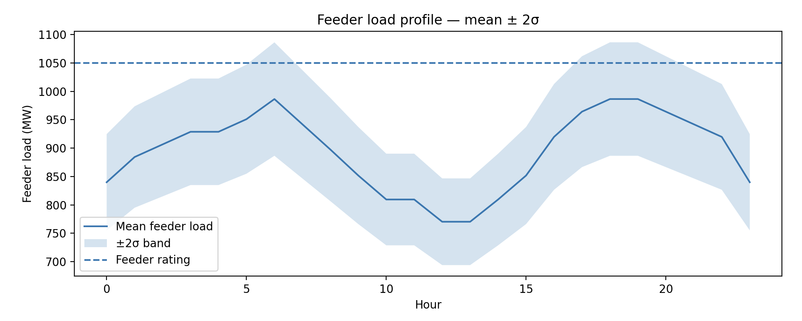
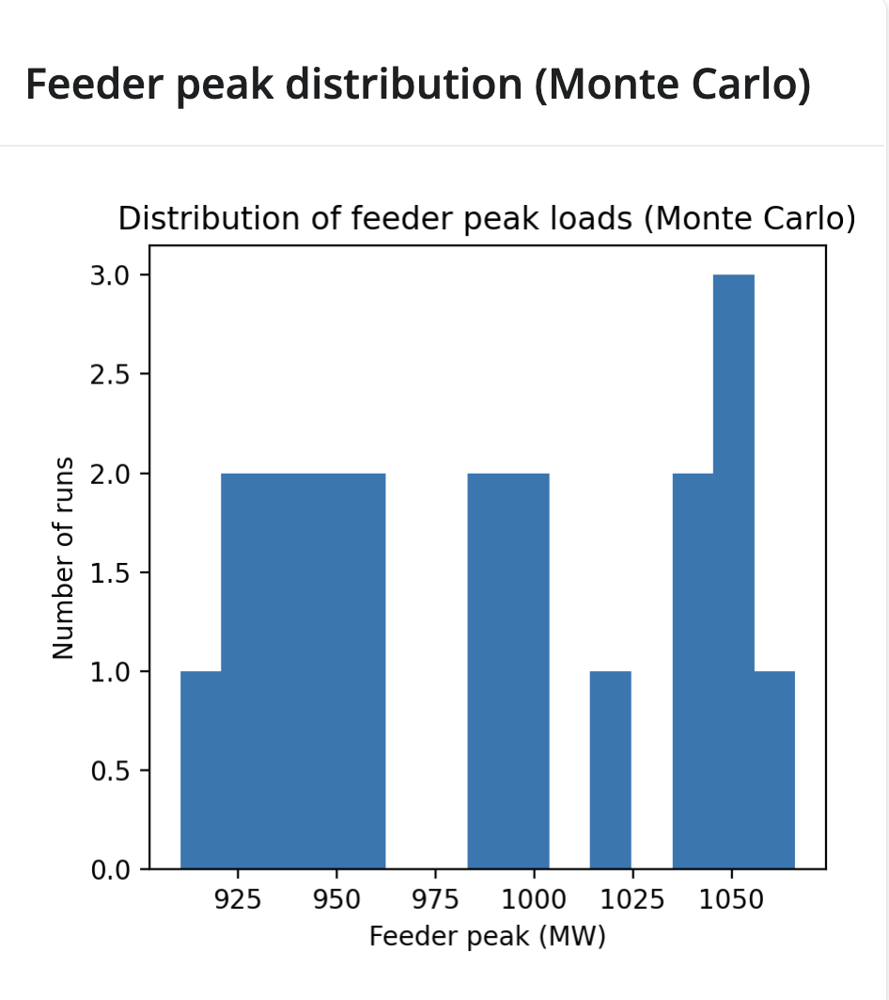
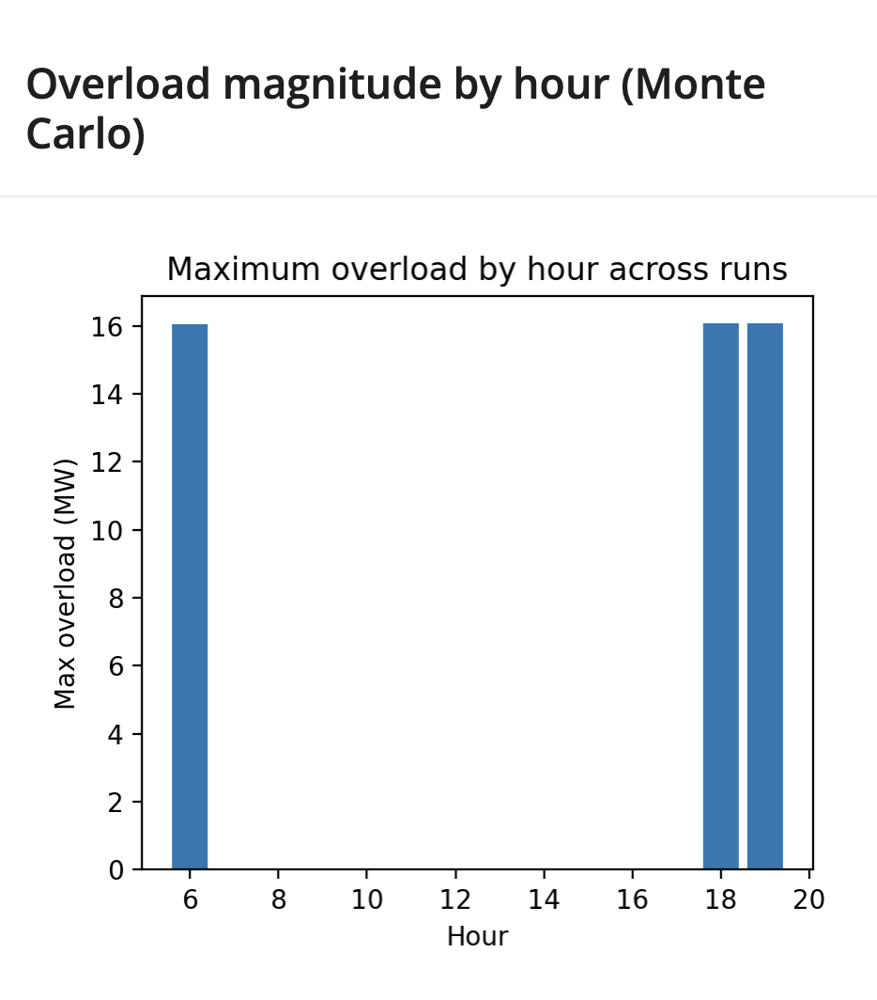
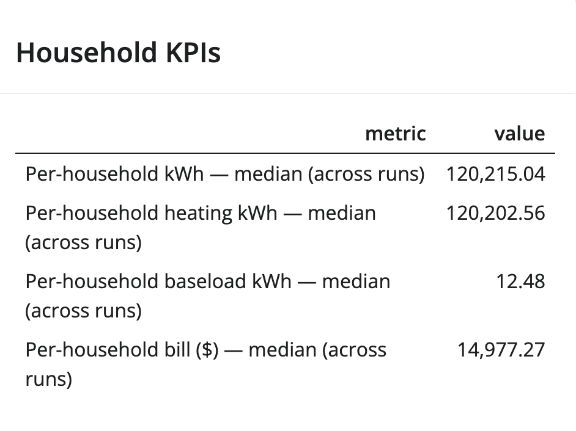
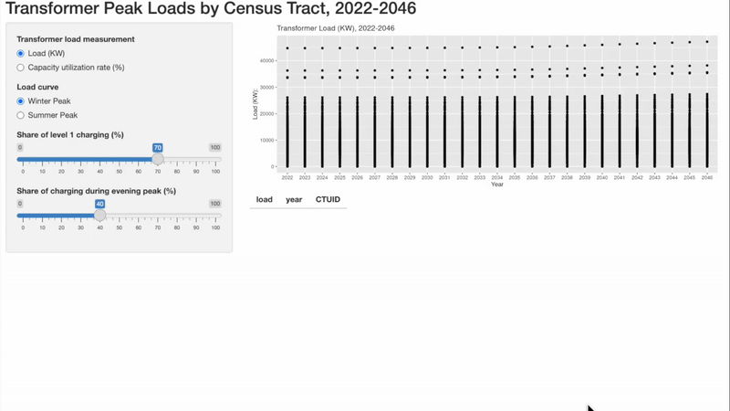

# Feeder-Level Winter Peak Mitigation — Microsimulation

[]()
[]()
[]()
[]()

Interactive Shiny for Python microsimulation for analyzing **winter feeder-level peak demand**, transformer overload risk, and household-level outcomes under different electrification and DR scenarios.

---

## 🚀 Live Demo  
**https://tonympeluso.shinyapps.io/feeder_microsimulation/**

---

## 🌍 Overview

Distribution utilities increasingly face **localized winter peak stresses** that system-level models fail to capture.  
This project implements a **bottom-up household microsimulation**, where every dwelling has:

- a thermal envelope and UA value  
- heating system (resistance, furnace, heat pump)  
- baseload shape  
- thermostat behaviors  
- stochastic variations  

The result: an **interactive feeder-level explorer** for planners, engineers, DR designers, and energy-transition consultants evaluating:

- heat-pump adoption strategies  
- thermostat setback / DR participation  
- extreme peak sensitivity  
- overload probability  
- customer-level energy & bill outcomes  
- feeder headroom under electrification  

---

## 🧩 Key Features

### 🎛️ Household Mix & Archetypes  
- Adjustable apartment / detached / other shares  
- Archetype-driven baseload, UA, setpoints

### 🧭 Policy Levers  
- Heat-pump penetration  
- DR/setback participation  
- Day/night setpoint deltas  
- Baseload multiplier  

### 🎲 Monte Carlo Engine  
- Multiple stochastic simulations  
- Mean ± 2σ feeder load band  
- Median KPIs to avoid outlier distortion  

### 📈 KPIs  

#### **Feeder-level**
- Peak MW  
- Peak hour  
- Daily MWh  
- Overload probability  
- Maximum overload magnitude  

#### **Household-level**
- Total kWh  
- Heating / baseload share  
- Median bill impacts  

### 🧪 Technology  
- **Shiny for Python** interactive UI  
- Full microsimulation backend in `src/`  
- Reusable in notebooks or batch Monte Carlo studies  

---

## 📊 Screenshots & Outputs  
*(Add your PNGs/GIF to `assets/` and replace the paths below)*

### Feeder Load Curve (Single Run)


### Monte Carlo Variability Band (Mean ± 2σ)


### Distribution of Feeder Peaks (Monte Carlo)


### Maximum Overload by Hour


### Household KPIs


### 🔄 App Demo (GIF)


---

## 🗂️ Project Structure
```
feeder_level_microsimulation/
├── app/
│ └── app_shiny.py # Shiny UI & server
├── src/
│ ├── data_loading.py # Data ingestion utilities
│ ├── heating.py # Thermal + heating model
│ ├── simulate.py # Microsimulation + Monte Carlo engine
│ └── tariffs.py # Tariff structure loader
├── data/
│ ├── archetypes.csv # Household archetypes
│ ├── baseload_profiles.csv # Non-heating profiles
│ ├── tariffs_tou.json # Tariff definition
│ └── weather_winter_design.csv
├── assets/ # Images/GIF for README
├── requirements.txt
├── README.md
└── .gitignore

```
---

## ⚙️ Installation & Running Locally

Create virtual environment:
```
python3 -m venv .venv
source .venv/bin/activate  # macOS / Linux
```
or
```
.venv\Scripts\activate     # Windows
```
Install dependencies:
```
pip install -r requirements.txt
```
Run app:
```
python3 -m shiny run --reload app/app_shiny.py
```
Visit:
```
http://127.0.0.1:8000
```

## 🧠 Modelling Approach
### 🔥 Thermal Model
UA heat-loss model

Setpoint-driven hourly requirements

COP-based heat pump modelling

Day/night schedule switching

### 💡 Baseload Model
Archetype-specific shapes

Multiplicative scenario adjustments

### 🎲 Stochastic Microsimulation
- Household sampling
- Behavior variability
- Monte Carlo feeder aggregation

### 📈 Output KPIs (per run & aggregated)
- Feeder load curve
- Peak MW & hour
- Overload hours (vs capacity line)
- Household energy + bill metrics

## 🔧 Development Notes
- Deployable using rsconnect-python to shinyapps.io
- Fully modular backend for external analyses
- All data is non-proprietary and replicable

## 📄 License
MIT License

## 👤 Author
Tony Peluso, PhD
Energy Modelling & Grid Analytics — Montreal, QC

📧 tonympeluso@gmail.com
🔗 GitHub: https://github.com/TonyMPeluso
🔗 LinkedIn: https://www.linkedin.com/in/tony-peluso-phd
